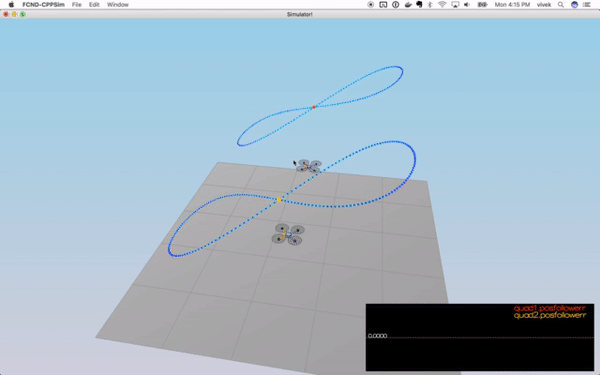

# The C++ Project Readme #

This is the readme for the C++ project.

For easy navigation throughout this document, here is an outline:

 - [Development environment setup](#development-environment-setup)
 - [Simulator walkthrough](#simulator-walkthrough)
 - [The tasks](#the-tasks)
 - [Evaluation](#evaluation)

### Implementation

Separated each of the implementations into separate commits with hyperlinks.

1) [Body Rate Controller](https://github.com/vivekg342/FCND-Controls-CPP/commit/098783891fc2a172ecc743b88cfc86b5700a3f07)

2) [Roll pitch controller](https://github.com/vivekg342/FCND-Controls-CPP/commit/ce687729df3314632c6764e77ec2c24aa04a1bcd])

3) [Altitude, Lateral and Yaw Controller](https://github.com/vivekg342/FCND-Controls-CPP/commit/0afdb770d2f79378cf3d7a4c691b583389ee906b)

4) [Generate Motor Commands](https://github.com/vivekg342/FCND-Controls-CPP/commit/098783891fc2a172ecc743b88cfc86b5700a3f07)

### Scenario 5 Animation
Video after tuning params

